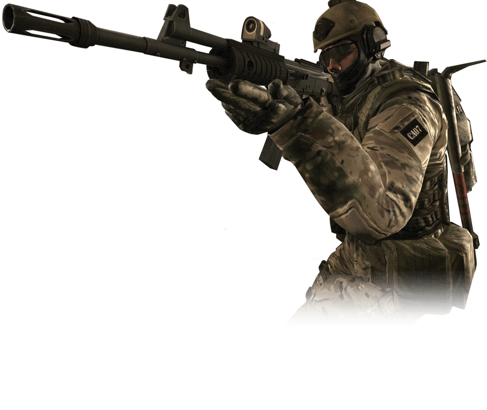

<html lang="en">
<head>
    <meta charset="UTF-8">
    <meta http-equiv="X-UA-Compatible" content="IE=edge">
    <meta name="viewport" content="width=device-width, initial-scale=1.0">
    <title>проба</title>
<link rel="stylesheet" href="css/style.css">
</head>
<body>
    

<header> <h1> Всем привет</h1></header>

    

        WelCome 
    

    

        
 

        
 

        

        <footer> </footer>
    

    

</body>
</html>
